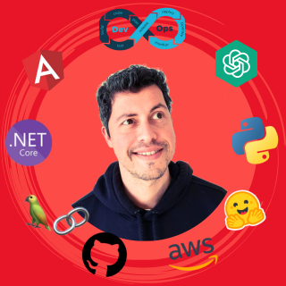

  

<h1 align="center">Fernando Ott</h1>

  <strong>Head of AI · AI Architect · 16+ yrs engineering · 4+ yrs AI/ML in production</strong> 
  Curitiba, Brazil &nbsp;·&nbsp; Remote-first &nbsp;·&nbsp; Open to global roles

  

  
  
  
  

  
  
  
  
  
  
  
  

---

> I design multi-agent AI systems that plug into real business tools, understand context, and make decisions autonomously. 16+ years shipping software. 4+ years deploying AI at scale. My focus is turning complex AI ideas into platforms that actually run in production.

> **This repo is itself a portfolio signal** — the architecture, TypeScript patterns, and AI integration choices here reflect how I build in production. → [Technical docs](docs/PROJECT.md)

---

## What I Do

I sit at the intersection of AI architecture, engineering leadership, and product thinking. I define technical direction, manage AI engineering teams, and ship systems that move real business metrics — not demos.

My core competency is **agentic AI systems**: multi-tenant platforms where agents specialize, hand off tasks, retrieve context from vector + graph + structured stores, and integrate with the tools businesses already use.

---

## Experience

### Head of AI & AI Architect — 8 Figure Agency
**Jul 2025 – Present · Remote (Santa Monica, CA)**

8 Figure Agency is an AI-first agency. I lead the design and execution of **Brain** — their multi-tenant, multi-agent AI OS.

Brain connects to client tools: CRMs, ad platforms, Slack, meeting tools, and data warehouses. It uses vector stores, graph databases, and structured stores together. The orchestration layer runs on LangChain and CrewAI with reusable agent patterns — adding a new client is configuration, not code.

- Designed and shipped Brain from whiteboard to multi-client production in months
- **Cut 20–30 hours of manual work per client per week**
- LLM strategy: model selection, prompting patterns, tool use, retrieval, guardrails
- Built evaluation frameworks for AI outputs
- Production observability with Grafana, Datadog, and LangSmith
- Stack: Python · Next.js · LangChain · CrewAI · MCP Server · Vector DBs · MongoDB · Supabase · PostgreSQL · AWS

---

### Tech Lead & Architect — KeHE Distributors *(NASDAQ: KEHE · $8B+ revenue)*
**Jul 2022 – Jun 2025 · Remote (Naperville, IL)**

Led the transformation of KeHE's B2B e-commerce search platform — millions of daily queries from retail buyers.

- **14× improvement in search speed**
- **2× improvement in sales conversion rate**
- **B2B client onboarding: 15 min → 2 min**
- Selected and implemented OpenSearch on AWS after guiding the team through a structured POC process
- Built flexible architecture enabling ads placement directly in search results
- Managed multiple engineering teams across retailer and back-office operations
- Stack: AWS · OpenSearch · .NET 8 · Angular · DynamoDB · SQS · PostgreSQL · Datadog

---

### Co-Founder & CTO — Polen
**Nov 2013 – Aug 2024 · Curitiba, Brazil**

Polen was the first social impact Open API in Latin America. I co-founded it, served as CEO for 2 years, then transitioned to CTO and ran the technical organization for ~10 years total.

- **$550K in venture capital raised**
- **5,000+ companies** using the platform
- **25M+ end users** reached
- **$1.5M+ in donations** processed
- ~20 direct reports; implemented OKRs and Scrum across the org
- Accepted to accelerators in Chile (Start-Up Chile), UK (DotForge Impact), and Brazil (Start You Up)
- Migrated from monolith to microservices (Docker, Kubernetes, Google Cloud)
- Stack: C# / .NET · Angular · MongoDB · Docker · Kubernetes · Google Cloud

---

### Early Career — Enterprise & Retail Systems
**2008 – 2013 · São Paulo & Curitiba, Brazil**

Built systems handling millions of transactions at Walmart Brazil, BuscaPé (anti-fraud), PRNewswire, FCamara, and MPS. This is where I built discipline in SQL optimization, unit testing, CI, and Scrum — and started managing teams.

Stack: ASP.NET / C# · SQL Server · jQuery

---

## What I've Built

### Brain — Multi-Tenant AI Platform *(8 Figure Agency)*
Multi-agent OS for business automation. Connects CRMs, ad platforms, Slack, meetings, and data warehouses. Agents specialize and hand off tasks through structured patterns. Reusable architecture means new clients are onboarded through configuration, not custom engineering. In production, cutting 20–30 hours/week per client.

### OpenSearch Platform — B2B Search *(KeHE Distributors)*
Rebuilt an e-commerce search platform from the ground up on AWS + OpenSearch. 14× faster. 2× better conversion. Enabled ads placement within search results. Still processing millions of daily queries.

### Cognia — AI Psychologist *(Side project)*
Multi-model AI system for psychological support. Three validation checkpoints before routing to a human. Fine-tuned for specific personality profiles and domain vocabulary in psychology. Built with safety as a first-class concern.

### TaskClaw — Open Source *(Personal)*
Kanban board with AI chat and bidirectional sync with Notion and ClickUp. [GitHub →](https://github.com/devotts)

---

## Technical Depth

**AI / LLM Orchestration**
LangChain · CrewAI · MCP Server · OpenRouter · LangSmith · RAG pipelines · hybrid search (vector + BM25) · fine-tuning · multi-agent architectures · guardrails design · eval frameworks

**Infrastructure & Cloud**
AWS (Lambda · SQS · S3 · DynamoDB · OpenSearch · CodeBuild · CloudWatch) · Docker · Kubernetes · Google Cloud · Vercel · Supabase

**Databases**
PostgreSQL · pgvector · MongoDB · DynamoDB · OpenSearch · Redis

**Languages & Frameworks**
Python · TypeScript · C# / .NET · Next.js · Angular · Node.js

**Observability**
LangSmith · Grafana · Datadog · CloudWatch · PostHog

---

## Where I'm Growing

I'm honest about gaps. These are areas I understand conceptually but haven't run in production:

- AI image and video generation pipelines
- Classical ML research (my ML is applied: RAG, fine-tuning, orchestration)
- OCR and document processing at scale
- Formal AWS certifications (extensive hands-on experience, no certs yet)

---

## Education

**B.Sc. Computer Science** — Universidade Federal do Paraná (UFPR), 2007–2011

Microsoft Student to Business (S2B) C# Program, 2008 · Startup Weekend Winner

---

## Content

I run **[Otimiza AI](https://www.youtube.com/@otimiza-ai)** on YouTube — practical content on building AI systems, agents, and automation in Portuguese.

---

## What I'm Looking For

AI Architect · Head of AI · VP of AI

Teams that actually ship AI to production — not teams doing POCs that never graduate. I want to work at the intersection of technical depth and business impact, in an environment where I can contribute at a strategic level.

Not looking for just any role. Looking for the right one.

**→ [LinkedIn](https://www.linkedin.com/in/feott/) · [Let's talk](https://www.linkedin.com/in/feott/)**

---

  <a href="docs/PROJECT.md">Technical docs & architecture →</a>

